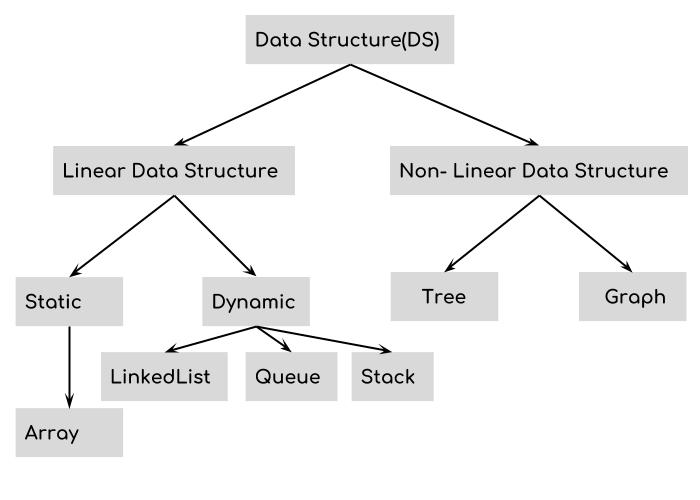
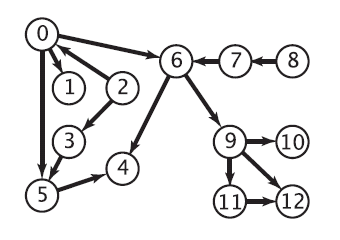

**Commonly-used data structures and algorithms**

([Previous Page](why-so-important.md))

LeetCode is one of the most fabulous websites for testing your problem-solving abilities in "Computer Science manners" (concretely, choosing proper data structures, and implementing algorithms to satisfy certain requirements). The time limitations of LeetCode's problems are super strict. Brute-force can be used to pass a limited number of them. To make things more challenging, all LeetCode problems have limitations on memory usage.

In order to help you tackle these problems, I would like to provide some learning and preparation suggestions. They may work for both coding contests and job interviews.

There are two ways of categorizing data structures. My preferred method is to organize them with "linear" and "non-linear":

From the other aspect, it is much more challenging to provide a list of "essential algorithms" because the number of algorithms is growing continually (the more you know, the better).

Nevertheless, advanced algorithms for solving specific problems must be built upon fundamental ones. Here are algorithms that are considered classical:
* Bellman-Ford (single source, weighted graph) - O[|V||E|]
* Topological Sort (directed acyclic graphs): Khan's algorithm - O[V+E]
* Floyd–Warshall (multi-sources, weighted graphs) - O[V^3]
* Dijkstra (single source, weighted graphs):
  - O[V+Elog(V)] in a priority-queue
  - O[E+Vlog(V)] in a Fibonacci heap
* Minimum Spanning Tree: Kruskal - O[E log(V)], Prim - O[E+V log(V)]
* Dynamics Programming: knapsack (pseudo-polynomial), KMP (failure function), shortest editing distance, minimum coins of changes - check online for individual time complexity

Based on the preceding choices, optimization is needed for sparse graphs, in which V is the number of vertices, and E is the number of edges. Also, note that the runtime may differ for specific problems.

([Next Page](text-books.md))
