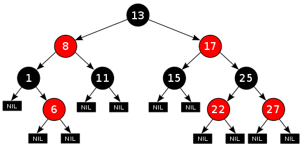

**Why are data structures and algorithms so important?**

Software development, in real cases, relies on a variety of comprehensive skills. "Design patterns for solving algorithmic problems" - like many university programs taught us - are ideal abstractions of real-world problems. Sometimes, merging source codes written by multiple people, compiling a package in your current environment, or developing a new API framework by yourself may bring much more pain than lower-level details related to performance.

That being said, efficiency is still one of the most difficult aspects of programming, for that reducing the execution time of a code usually requires far more knowledge than expected. Most IT companies' job interviewers evaluate their interviewees' abilities from the way they answer algorithmic problems. It has been widely addressed that algorithm engineers are paid higher salaries than other software developers, although some do not agree with it. In any case, "data structures and algorithms" are primary skills for programmers to go to their dream places (prestigious companies like Nvidia, for example).

From the micro-level, concepts like graph theory and discrete mathematics used by computer scientists determine how objects/events are allocated in computer memories and how each record is related to its neighbors, which usually results in an impact on execution efficiencies. Although this may not matter for small problems, the effect accumulates and eventually becomes significant as a project grows larger. Concerns about these aspects make Computer Science (CS) to some extent - although not totally - different from other subjects that require code writing skills.

Thanks to the ingenious usage of Red-Black Trees (time complexity O[log N]) in the Linux kernel, searching in a dataset containing 1,000,000,000 elements requires 30 comparisons only. In contrast, a naive approach (time complexity O[N]) usually requires many more operations than this. Since 2012 while studying in Canada, I have been fascinated by many coding contests, including the most well-known Google Code Jam. Many people like me believe that in the computer industry, skills in writing efficient codes make a gigantic difference (not only for ACM, particularly), for which I have been working much harder on learning algorithms rather than the syntactic aspect of programming languages.

([Next Page](ds-and-algorithms.md))
